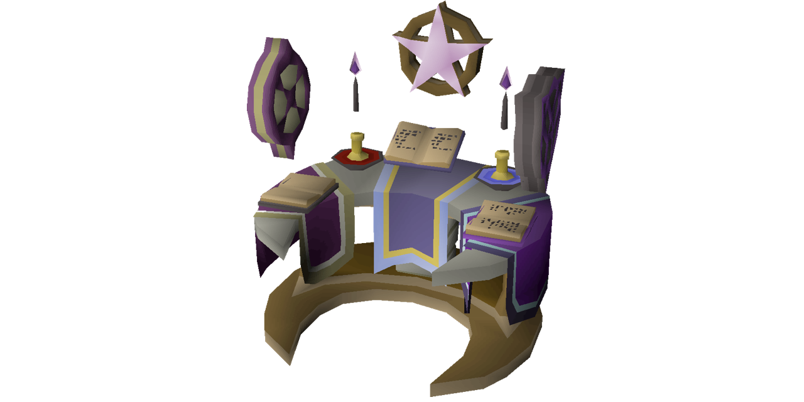

# **A**wtrix **L**istens **T**o **A**ltar **R**equests

> [!WARNING]
> This project is a work in progress and is not yet ready for use.

## Summary

Altar is a library for golang that allows developers to create custom Applications for the [Awtrix](https://blueforcer.github.io/awtrix3/#/) platform. Its aim is to provide a simple and intuitive manner to stand up a broker with a collection of applications to control the display of Awtrix supported devices.

### See it in action

You don't need an awtrix device to run this project. To see it in action you can install [devbox](https://www.jetify.com/devbox/) and run `devbox services up` to see the requests from the example application get captured by a request logger.

## Using the library

### Quickstart

First define an Application:

```go
package main

import "github.com/t-monaghan/altar/application"

func helloWorldFetcher(app *application.Application, _ *http.Client) error {
	app.Data.Text = "Hello, World!"
	return nil
}

var HelloWorld = application.NewApplication("Hello World", helloWorldFetcher)
```

Then define the main function, starting the broker with a list containing the above application:

```go
package main

import (
	"fmt"
	"log/slog"
	"net"
	"os"

	"github.com/t-monaghan/altar/application"
	"github.com/t-monaghan/altar/broker"
)

func main() {
	helloWorld := application.NewApplication("Hello World", helloWorldFetcher)
	appList := []*application.Application{&helloWorld}
	broker, err := broker.NewBroker(
		"YOUR_AWTRIX_IP_HERE",
		appList,
	)

	if err != nil {
		slog.Error("error instantiating new broker", "error", err)
		os.Exit(1)
	}

	broker.Start()
}
```

Finally, run your program:

```sh
go run .
```

### Going deeper

Fetchers with more functionality can be found in the [examples](https://github.com/t-monaghan/altar/tree/main/examples) package.

## Contributing

This project is not currently accepting contributions, however I will be streaming my development of this project through a Zed channel [here](https://zed.dev/channel/altar-22876).
